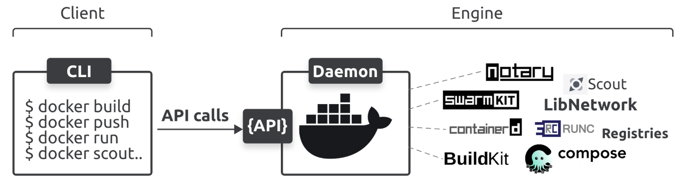

# Docker

* **Containerized app** → Application running in a container; Kubernetes is used to deploy and manage these apps.
* A container packages up code and its dependencies, allowing the app to run quickly and reliably from one environment to another.

### Two Major Parts of Docker:
* **CLI (Client)**: Command-line tool to manage and deploy containers. It converts simple commands into API requests and sends them to the engine.
* **Engine (Server)**

#### Commands

* **docker version** to check the docker installation
* **docker images** get info about docker images 
    **Docker Images**
    - **Definition**: A read-only template that includes everything needed to run an application (code, libraries, dependencies).
    - **Immutable**: Once created, images cannot be changed; modifications create a new image.
    - **Layered Structure**: Built in layers for efficient storage and reuse.
    - **Purpose**: Used to create containers.

    **Docker Containers**
    - **Definition**: A running instance of a Docker image that includes everything to execute the application.
    - **Mutable**: Containers can be changed while running; modifications don’t affect the original image.
    - **Isolation**: Run independently from each other and the host system.
    - **Lifecycle**: Can be created, started, stopped, and deleted, while images remain unchanged.

    * pulling - copying new images to your docker host **docker pull ubuntu:latest**

* **docker run** to start a new container
* **docker ps** to list running process and use " -a" flag to check the hidden processes
* **docker attach** to attach your shell to the container's main process
* **docker stop <container name>** to stop the container
* **docker rm <container name>** to kill the container 